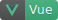
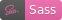
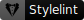
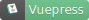

# Miya UI


### Introduction

A Miya UI library for both Vue3+ and React17+

[简体中文](./README.zh_CN.md)

### Features

* Small size
* Written in TS
* Support for dark mode
* Support for customize theme color
* Strong and flexible config form

### Online Demos & Docs

* [Miya UI - React](https://miya-ui-react.donsen.site/)
* [Miya UI - Vue](https://miya-ui-vue.donsen.site/)

### Install

#### For Vue3 users

* install

```sh
npm install miya-ui-vue
```

* global use

```js
import { createApp } from 'vue'
import CasualUI from 'miya-ui-vue'
import 'miya-ui-vue/dist/style.css'

const app = createApp()
app.use(CasualUI)
app.mount('#app')
```

* single use

__Notice：single usage also need import style__

```vue
<!-- SomeComponent.vue -->
<script setup>
import { CButton } from 'miya-ui-vue'
</script>
<template>
  <c-button label="A Button" />
</template>
```
#### For React17+ users

* install

```sh
npm install miya-ui-react
```

* import styles in your entry file

```js
import 'miya-ui-react/dist/style.css'
```

* usage

```js
import { CButton } from 'miya-ui-react'

function SomeComponent() {

  return <OButton label="A Button" />
}
```

### Contributing

[CONTRIBUTING](./CONTRIBUTING.md)

### Thanks










### LICENSE

[MIT](./LICENSE)
